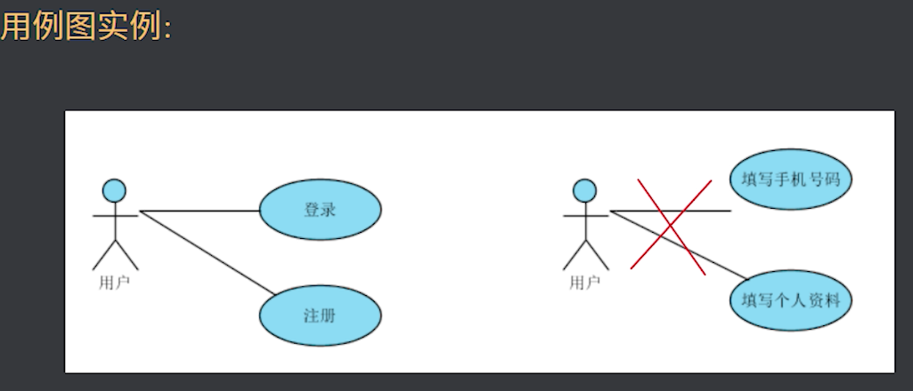
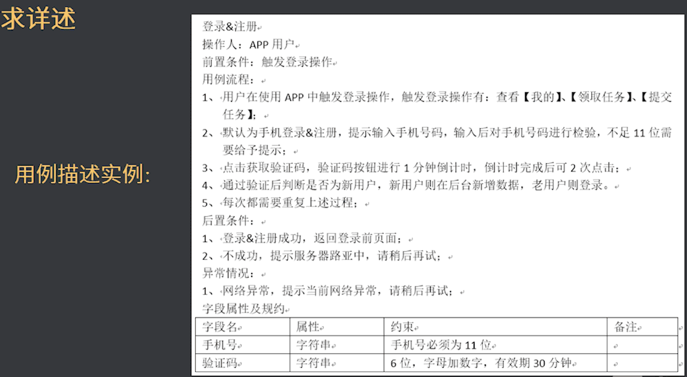
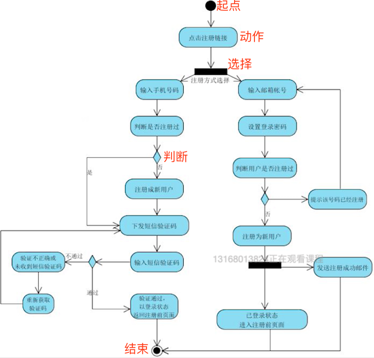
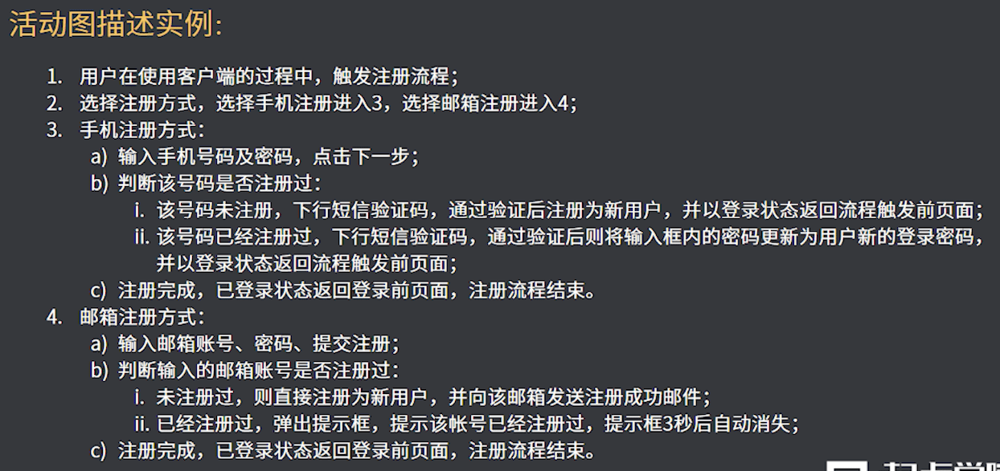
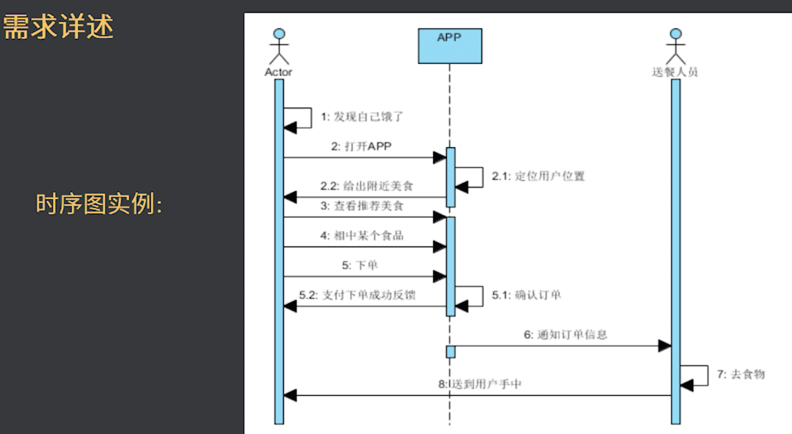
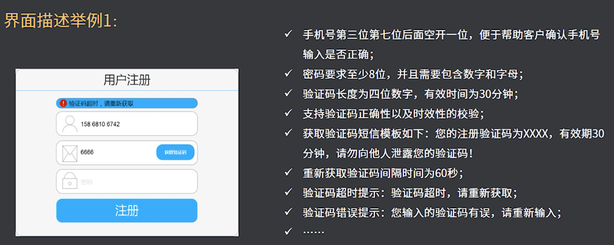
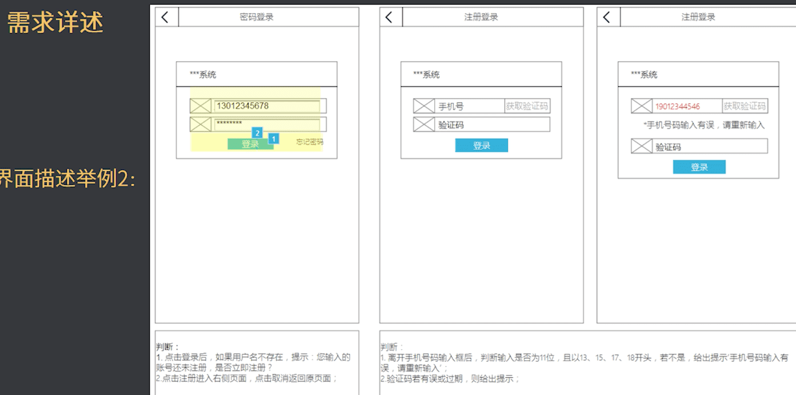

<!-- 如何撰写PRD需求文档 -->

## 一、PRD需求文档内容
1. 文档说明：编辑历史、目录；
2. 产品说明：概述、名词解释、产品框架、信息框架、页面逻辑、功能列表；
3. 功能说明：流程说明、界面说明、数据字典；
4. 非功能需求：安全性、易用性、性能需求；
5. 附录：参考资料，参考文档

## 二、如何撰写产品描述：
1. 项目说明：叙述产品功能、预期实现目标（可分阶段实现）；
2. 缩略语/名次解释/专有名次：简单描述约定俗称的名词，减少交流偏差 ；
3. 产品框架【脑图】（重要）：展示产品各个页面中的内容、功能细分 ；
4. 信息结构：展示产品中所有信息字段，如国人信息包括（姓名昵称电话等）、脑图/Excel独立展示 ；
5. 页面跳转逻辑流程：展示产品各个页面之间的跳转逻辑（也可在原型图中体现） ；
6. 功能列表：列举本次产品迭代中所有的功能点，备注功能点的优先级（可包括开发人员、大致周期）；

## 三、需求详述

### 1）用例图
>用例图的描述一般由：参与者、前置条件、主流程、一场流程、后置条件、用力规约组成【谁，去完成一件事】

      
    

### 2）活动图
>在实际环境中被称为流程图，是产品中最常见到的图

      
      

### 3）时序图
>按时间的排列对对象的交互进行模拟，时序图和活动图是想通的

      

### 小结
1. 用例图能帮助我们理清楚系统到底需要做什么功能；
2. 活动图能帮助我们理清楚功能内部的执行逻辑；
3. 时序图能帮助我们理清楚整个业务场景的发生顺序；
4. 三种表达方式运用的原则是：哪个更有利于表达就用哪个

## 四、界面描述
>- 界面描述主要是对界面的展示、交互的描述。需要比较清楚的描述出界面上应该战线的元素以及元素的要求。  
>- 界面描述可以再PRD中体现，也可以在原型中体现。

      
      

## 非功能性需求（一般写如下方面）：
- 安全性：对产品安全方面的要求；
- 易用性：用户在使用中的友好程度≈用户体验的一部分（默认值，上下限，错误提示，网络错误，响应时间过长，黑夜模式切换）；
- 统计需求：需要记录哪些数据，以便开发提前埋点，（PU，UV，某页到某页的跳转率、跳出率）
- 性能需求：需要说明产品要达到的性能要求（打开用时几秒内，加载时间。多少秒无响应给出提示）

## 五、附加内容
### 1）写需求的八项思路
1. 合理的建立全局观,把握整体框架;
2. 合理的建立业务模型;
3. 合理的拆分系统需求;
4. 合理的预留系统扩展;
5. 合理的处理好业务流,信息流,以及数据流;6、合理的遵从:业务原理(逻辑)”→系统实现原理(逻辑),然后细分到-模块实现原理(逻 辑)、具体到-界面交互原理(逻辑);
7. 合理的编排需求的优先级次序;
8. 合理的做好需求被 KO 掉的准备。

### 2）写需求的十点注意
1. 写文档,一定不在拘泥于工具,在于思路;但用好工具,会使你的需求加速;
2. 写文档,一定先定义流程,后定义交互原型,原型仅是需求交互的载体;
3. 写文档,一定要划分好优先前后级,核心的、主要的需求先走,其它的可以缓后;
4. 写文档,一定要基于可开发,不能天马行空。(IDEA 阶段可以天马行空);
5. 写文档,一定要规范,目录、层级都清晰,写出来别人是要看的;
6. 写文档,一定要清晰明了,不在于是否写的多,在于是否真正说明了问题;
7. 写文档,一定要学习竞争者的长处,可以把好的东西借鉴过来,吸取精华;
8. 写文档,一定要落实到每个细节,需求都不完善,成品何来完善;
9. 写文档,一定要自己多看,自己给自己找茬,把问题止步于自己;
10. 写文档,一定要注意版本管理,并做好版本修订等工作。

### 3）写需求的八个步骤
1. 第一步:需求分析(业务模型、业务机制、系统功能、系统逻辑);
2. 第二步:确定产品定义;
3. 第三步:确定用户目标和用户任务;
4. 第四步,确定产品具体定位;
5. 第五步,确定设计产品用例、流程;
6. 第六步,确定设计产品原型;
7. 第七步,打包需求说明文档;
8. 第八步,最后确定产品优先级(核心的、主要的、扩展的);

