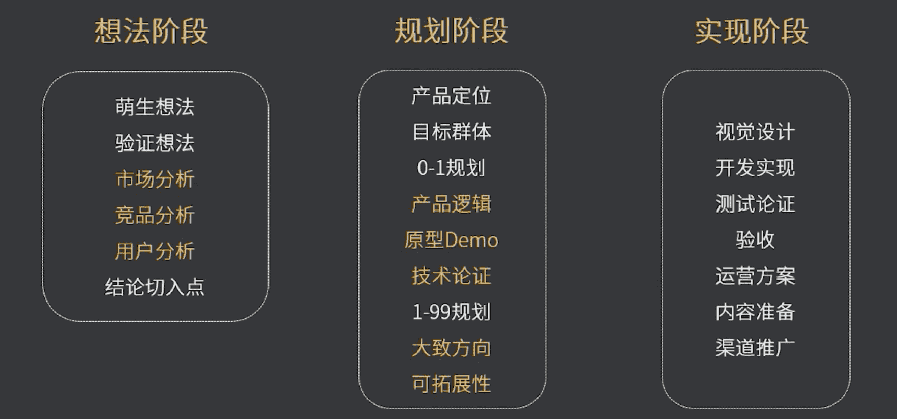
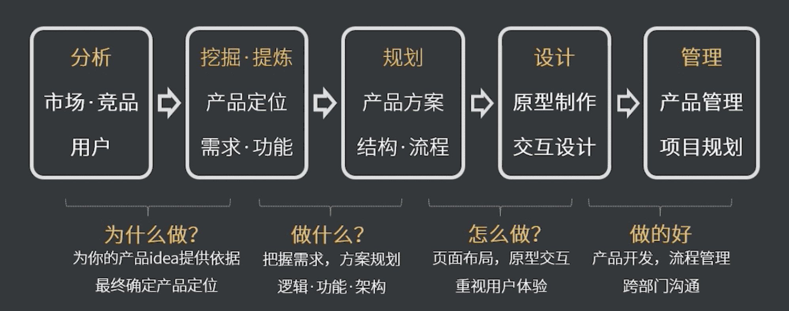

## 什么是互联网产品：
>1、能够直接解决用户的痛点和需求  
2、是指座位商品提供给市场，被人们使用和消费，并能满足人们某种需求的任何东西。包括有形的物品、无形的服务，组织、观念或他们的组合 

#   

## 什么是产品经理
>负责时长调查并根据产品、市场以及用户等的需求，来确定开发何种产品，选择何种业务模式、商业模式等。
并推动相应产品的开发组织，还要根据产品的生命周期，协调研发、营销、运营等，确定和组织实施相应的产品策略，以及其他一些相关的产品管理活动

#   

## 如何成功从技术转型产品经理：
1. 要有想法，有产品感觉，对新事物敏感 
2. 强大的驱动能力和沟通能力 
3. 逻辑思维能力，认真细致 
4. 抗压能力 
5. 热情 
6. 审美能力

#   

## 产品经理的要求
做产品功能前，先要知道产品的：
1. 运作方式
2. 商业模式
3. 变现方式 
4. 产品方向

#   
---

## 产品如何从0-1概述

1. 想法阶段（分析）
    - 市场分析
    - 竞品分析
    - 用户分析
    - 需求分析
    - 数据分析
2. 规划阶段（设计）
    - 拟定方案
    - 产品设计
    - 需求输出
3. 实现阶段（进度）
    - 流程管理
    - 进度管理
    - 风险管理
    - 预期管理
    - 知识管理
4. 全阶段
    - 善于沟通
    - 团队协作
    - 分享成长
    - 团队管理

简要概括：  
1. 调研与分析（想做的产品有没有目标市场，是否解决了用户的问题）
2. 需求规划（需求清单、功能列表）
3. 设计（页面流程交互设计(点击，长按，滑动...)、原型设计、视觉设计）
4. 开发（团队合作、协调进度、测试）
5. 发布（线上数据准备、运营方案、用户培训、渠道推广）
6. 迭代优化（数据追踪分析、功能改进、运营策略、用户反馈）—— 1-99

