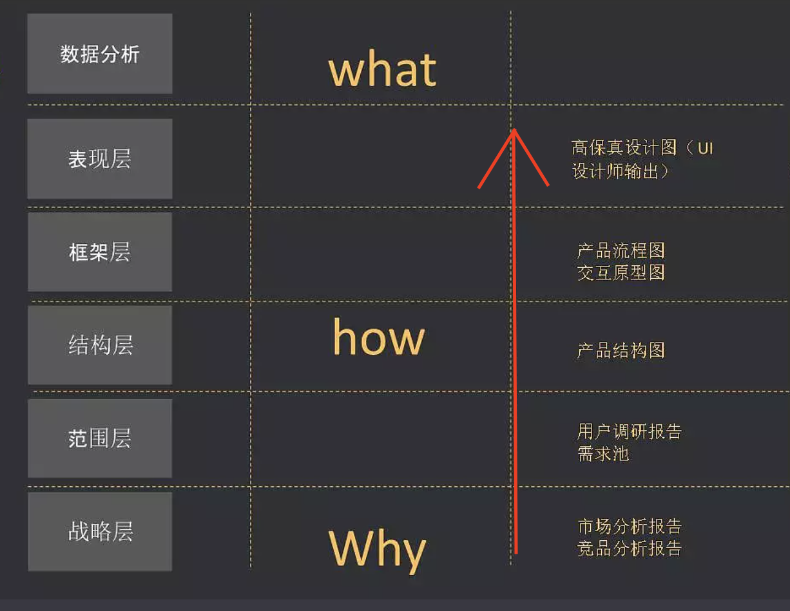

<!-- 产品流程概述 -->

## 一、动手之前
要了解：
1. 为什么要做竞品分析，
2. 为什么要做用户研究，
3. 竞品分析和需求分析有什么关系等等。

>**Why：我要做一款什么用的产品**
>- 明确目标：产品要解决`什么用户`在`什么场景`下的`什么问题`？

* 什么用户：微信 or 电话手表 (相同的需求有不同的用户群体)  
    - 电话手表被微信视为威胁，手表从小孩子构建了关系链，长大后就不用微信or手机
* 什么场景：快餐厅 or 高档餐厅  
    - 场景不同
* 什么问题：痛点（急需解决方案），痒点（要不要无所谓）

## 二、市场发展阶段（行业）
* 导入阶段  
——快速迭代，重视产出
* 发展阶段  
——竞争激烈，重视产品质量，更好地满足用户需求
* 成熟阶段  
——重视服务、用户体验、运营、营收、A/B Test
* 退出阶段  
——用户需求依然存在，重视利用最新技术做产品创新

## 三、竞争模式
* 单寡头（垄断）      ——可切入
* 双寡头（可口可乐，百事可乐）   ——这种行业需要回避
* 多元（汽车、化妆品、餐饮）     ——可切入，要有特色

## 四、整体流程

    

