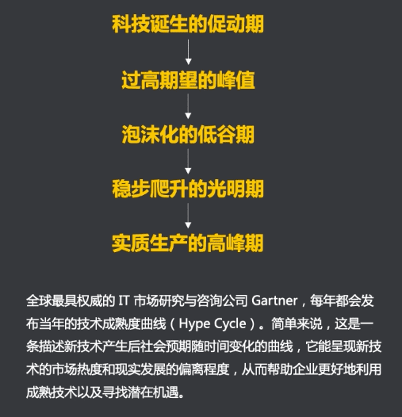

<!-- # 商业模式 -->

## 一、商业模式--产品成败的关键

    

## 二、商业模式基础定义
>为实现客户价值最大化，把能使企业运行的内外各要素整合起来，形成一个完整的高效率的具有独特核心竞争力的运行系统，并通过最优实现形式满足客户需求、实现客户价值，同事使系统达成持续盈利目标的整体解决方案。    
内核：用和学的管理方法权衡供给侧和需求侧的相处之道

    

### 产品经理为什么要关注商业模式：  
* 产品：满足用户/市场需求的具象化解决方案  
* 经理：集合资源推荐方案顺利进行的决策者

    

>商业模式的规划能力是产品经理的核心专业能力之一

## 三、商业画布
>商业模式画布：一种用来描述商业模式、可视化商业模式、评估商业模式以及改变商业模式的通用语言

    

### 1）重要伙伴KP
>定义：为了让商业模式有效运作所需的供应商和合作伙伴  
举例：支付宝“城市服务”中很多民生应用都来自第三方服务供应商（ISV），这些供给侧的角色就是KP。
* 谁能帮助我们？
* 谁是我们的重要伙伴？
* 谁是我们的重要供应商？
* 这些合作方相互之间的关系如何？

### 2）关键业务KA
>定义：描绘公司主要开展的业务内容，可以基于其他几个模块分析  
举例：爱奇艺主要提供视频资源，一方面通过采购版权获得相关影片的播放权，同事也会做很多自创节目。
* 为实现我们公司的价值观需要哪些关键业务？
* 我们的渠道通道需要哪些关键业务？
* 我们的客户关系对业务有无影响？
* 这些关键业务如何收费？

### 3）核心资源KR
>定义：商业模式运转所必须的资源  
举例：阿里云拥有中国最大的数据云存储资源，包括服务器、运维团队等，这就是核心资源。
* 我们有哪些实体资源（人力、物力）？
* 我们有哪些虚拟资源（专利、数据）？
* 我们有哪些竞争对手没有的资源？
* 这些核心资源如何有效利用？

### 4）价值主张VP
>定于：企业为客户创造价值的产品或服务  
举例：今日头条根据用户的行为模型和画像标签提供高质量的咨询内容，解决了用户的新闻消费需求。
* 我们应该传递怎样的价值观？
* 我们如何有效解决用户的痛点？
* 我们正在提供哪些产品和服务？
* 我们对于用户的价值是什么？

### 5）客户关系CR
>定义：企业与客户建立的关系以及如何维系关系  
举例：抖音很多网红机构，一方面通过创建KOL来吸引用户关注，另一方面也在拓展电商板块，做流量转化。
* 客户想和我们保持什么样的关系？
* 如何吸引更多的新用户？
* 如何留住已有的存量用户？
* 如何做现有潜在用户的转化？

### 6）渠道通道Channels
>定义：企业服务流程中触达用户的路径  
举例：传统触达客户的成本很高（短信..），随着渠道的多元化（微信..），可以极大的降低这种触达成本。
* 我们有哪些渠道可以接触用户？
* 哪些关系已经建立？
* 哪些关系需要新建？
* 维系这种关系的通道成本是多少？

### 7）客户细分CS
>定义：描述企业想要接触和服务的不同目标人群或机构  
举例：大部分游戏平台，都会通过提供收费服务来区分不同用户，进而提供高阶游戏体验。
* 用户有哪些类型？
* 谁是我们的VIP用户？
* 我们如何为这些不同的用户提供有效服务？
* 这些用户标签是否可以相互转化？

### 8）**成本结构**！！
>定义：运营一个商业模式所需要的所有成本  
举例：新东方在线的很多课程来源线下班。原成本涉及到场地费、物业费、现场物料费等，如果转移到线上。则会减少很多运营成本。
* 日常运作中需要哪些固定成本的支出？
* 哪些成本是可以控制的？
* 人力资源成本如何优化？

### 9）收入来源
>定义：公司通过向用户群体提供服务获得的收入  
举例：阿里巴巴电商平台，最主要的两个收入来源，一个是卖家的平台使用费，一个是买家流量带来的广告费。
* 哪些用户愿意付费？
* 用户更愿意买哪些服务？
* 这些收入渠道能否规模化？

## 四、商业画布案例解析

      
      
    

## 五、商业画布拓展资料
1. 商业模式画布评估  
http://www.woshipm.com/pmd/867719.html

2. 商业模式的定义——做产品到底是做什么  
http://www.woshipm.com/pmd/1536950.html

3. 除了商业模式画布，还有两个重要的商业工具你该知道  
http://www.woshipm.com/pmd/768767.html

4. 如何让商业模式画布给产品指条明路？  
http://www.woshipm.com/pd/852977.html

