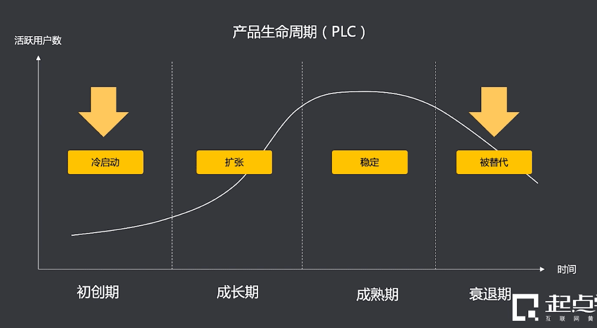

<!-- # 市场分析 -->

## 一、什么是市场分析

      
    

>**市场分析的概念**：市场分析就是对市场容量、市场规模、市场特效等相关内容进行的客观的统计及预测。  

>**市场分析的目标**：更准确的了解供给侧和需求侧之间的关系（商业模式），科学制定战略规划。   

>市场分析是**验证商业模式准确性**的最佳方式

>**市场分析原则**：
- 了解行业现状，评估尚未启动项目的可行性；
- 目标为导向，制定未来的产品规划，争取项目资源；
- 数据位依归，评估已有项目的市场定位；

>**什么时候做市场分析**：

      

>**市场分析的价值**：
* 企业：策略制定的基础、规划实施的保障、商业模式构建的基础
* 个人：快速了解行业、提高行业理解力及融入度的好办法、培养个人系统性思维及信息加工能力

## 二、市场分析的常见分析方法

      

### 1、行业背景分析
#### 1) 宏观经济分析--PEST
>PEST（政治、经济、社会、技术）  
评估”能不能做“

      
      

#### 2) 竞争态势--波特五力模型
>波特五力模型
- 供应商的议价能力
- 购买者的议价能力
- 新进入者的威胁
- 替代品的替代能力
- 同业竞争者的竞争程度

      
      
      

#### 3) 行业技术预测
* 未来技术的发展趋势
* 对于行业/产品的影响
  

### 2、市场现状分析
#### 1) 市场阶段
>（初创期、成长期、成熟期、衰退期）
#### 2) 市场规模
>主要是是研究目标产品或行业的整体规模，包括目标产品或行业在一定时间内的产量、产值等，表现为根据人口数量、人们的需求、年龄分布、地区的品复读调查所得的结果。  
1. 从供应端和专家得到的信息和数据，并以此进行市场推算
2. 从消费端进行分层抽样在进行数据汇总
3. 同事采集供应端和消费端数据，并进行数据交叉验证

      

### 3、微观个体分析

#### 1) SWOT分析（态势分析法）
* Strengths（优势）
* Weaknesses（劣势）
* Opportunities（机会）
* Threats（挑战、风险）

      
      
      

#### 2) 用户分析（后续讲解整理）
* 问卷调查
* 用户访谈
* 用户画像
* 数据分析

