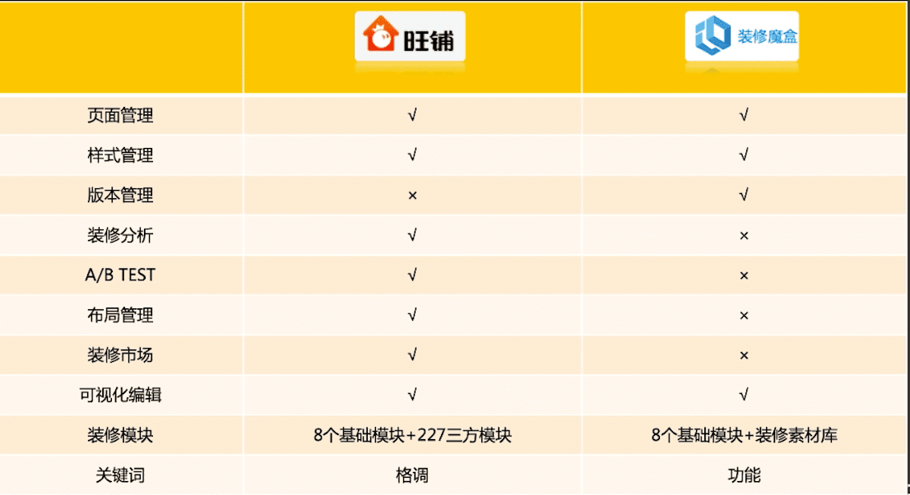

<!-- # 竞品分析 -->

## 什么是竞品分析
### 1) 定义
>对市场上直接或间接的竞争对手的产品进行比较分析，分析维度包含但不限于功能、交互、视觉、流程、文案、运营方式等。

直接竞争对手|间接竞争对手
:--:|:--:
市场环境相似|市场环境相似
商业模式相似|商业模式不同
目标用户相似|目标用户相似
&nbsp;&nbsp;&nbsp;&nbsp;产品功能相似&nbsp;&nbsp;&nbsp;&nbsp;|产品功能不同但未来可能相同

### 2) 竞品分析的意义
- 战略选择  
    产品核心竞争力的建立、资源分配的合理化布局合理制定预期目标
- 产品优化  
    需求来源之一、竞争压力迫使产品优化
- 个人成长  
    逻辑思维的锻炼、行业理解力的提升、用户导向概念的深化、书面表达能力的增强

### 3)竞品分析的目标
- 熟悉市场环境：确定产品的市场空间
- 制定竞争策略：根据直接或间接竞品的现状规划产品策略
- 提供解决方案：借鉴竞品处理同样问题的方式
- 完成数据监控：通过观测迭代版本推测竞品的产品规划

### 4)竞品分析的分析维度
>**分析维度取决于分析目标**：
>- 要不要做这个功能----战略目标；
>- 功能细节如何把控----功能目标；
>- 用户路径是否完整----体验目标；

举例：

    

### 5)竞品分析的产出格式(竞品分析文档)
1. 竞品分析的目的
2. 所处市场行业分析
3. 竞品选择
4. 竞品的深度分析  
    - 定位分析
    - 功能分析
    - 策略分析
5. 分析总结
6. 自身产品切入点思考

