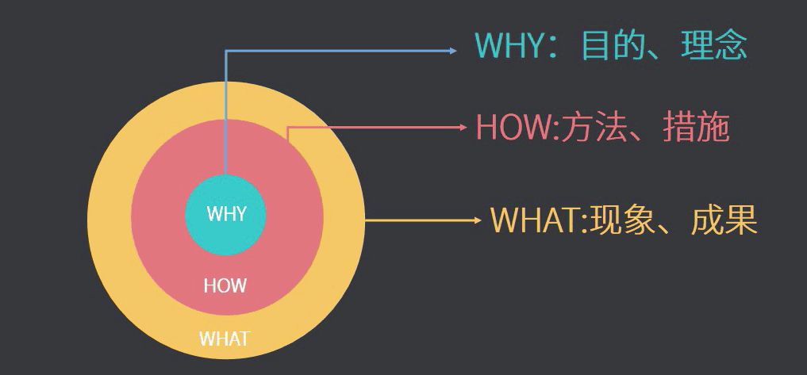
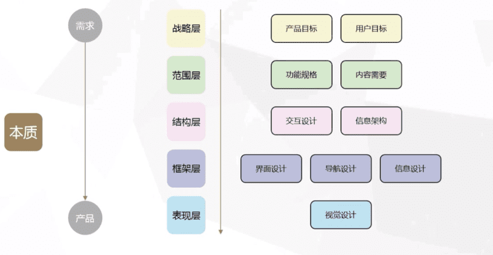

## 黄金圈法则

以注册为例：   
1. Why=为什么要登录
2. How=有哪些登录方式，怎么登录
3. What=结论

>无论是产品分析过程中，还是生活中，都可以用黄金圈法则来换个角度思考问题。其中 **`Why`** 是核心。

#   
---
## 用户体验要素
 

### 战略层
>产品根本的出发点&定位，解决什么需求
1. 产品目标:
    1. 商业目标是什么 
    2. 确立怎样的品牌形象 
    3. 设立哪些指标作为成功标准（细分指标） 
2. 用户需求:
    1. 用户细分方法（人口统计学、消费心态档案、用户认知程度；多维度的分类思考，骄傲和配合掌握全貌） 
    2. 用户研究方法（问卷调查、焦点访谈、用户测试、创建人物角色等；信息不完整时通过想象和合理的推断）

### 范围层
>【抽象概念】产品所提供的商品&服务
1. 功能需求:
    - 具体满足用户哪些需求（障眼需求、根本需求、潜在需求） 
2. 内容需求（视频app为主）
    1. 与功能需求想配合、融合 
    2. 收集和管理内容资源 
    3. （细化）功能规格说明（具体描述，逻辑清晰）

### 结构层
>功能结构、信息结构（不同的商品服务分类放置）
1. 信息架构
    1. 组织原则（与战略层的目标和需求对应，识别用户信息汇总重要的信息呈现）
    2. 结构化方法（层级式结构、矩阵结构、自然结构、线性结构；结构从上到下，或者从下到上，或其他，具备适应结构变动能力） 
2. 交互设计 
    - 设计概念模型：用现实生活中某个事物为原型

### 框架层
>【实体概念】信息设计，界面设计，导航设计（概括为产品如何告诉用户提供了哪些服务以及如何使用）
1. 导航设计:
    1. 目标：实现跳转、穿法各导航按钮的关系，页面之间的关系
    2. 做法：清楚地告诉用户，他们他那里，来自哪里，他们可以去哪里 
2. 信息设计:
    1. 说明：微观信息架构在具体页面的信息呈现
    2. 将信息分类，按优先级排列，遵循用户的思路
3. 界面设计:
    1. 用户一眼就能看到和使用最重要的东
    2. 基于用户最常采用的行为，交互元素的布局要让用户用最容易的方式获取和使用

### 表现层
>给用户带来的最直观的印象，外观，颜色，logo等
- 视觉设计:
    1. 延续上层确立的产品思路，给予相应的视觉效果支持（传递品牌形象等）
    2. 不破坏网站结构，加强各个模块之间的区分
    3. 用户浏览轨迹是流畅的路径，各个设计元素不会分散用户注意力，视觉引导支持用户与完成他们的目标任务
    4. 内部视觉设计的一致性

