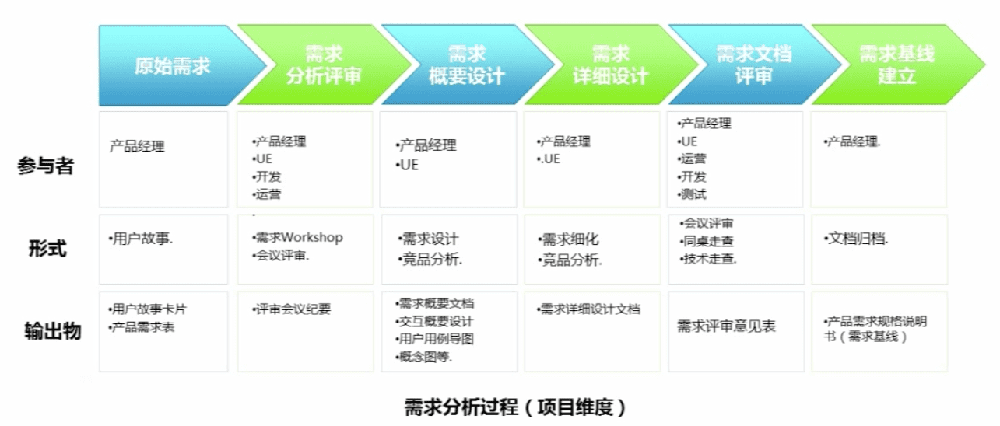
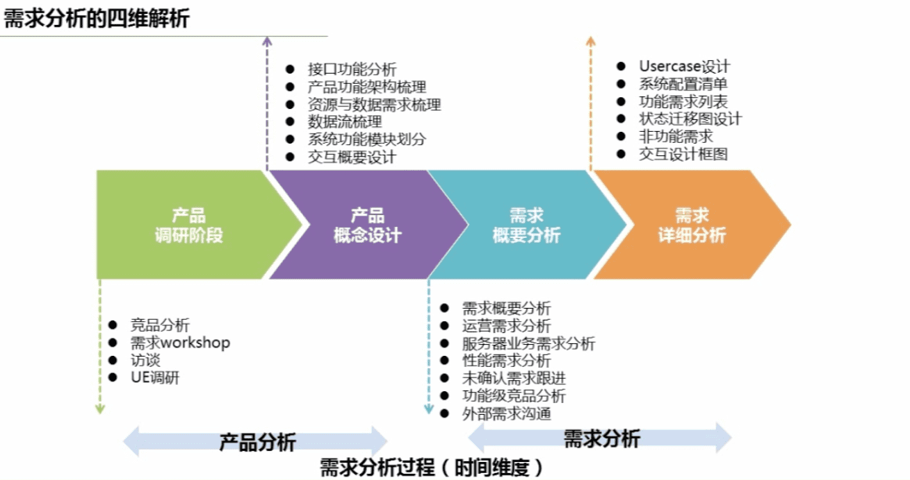

### 产品需求分析0-1

#   

### 功能性需求分析基本方法
>1. **业务需求**：是产品对于系统的高层次系统级要求，定义了产品的总体项目架构和模块划分，即确定产品的发展方向、功能范围、目标客户和价值来源。（脑图、系统架构图、系统模块图、产品结构图、信息架构图、产品概念图）

>2. **用户需求**：用户故事（作为什么样的用户，先怎样做，然后怎样做，最后达到一个怎样的结果，以便我完成了一个怎样的功能和业务价值）  
>    - **用户故事准则**：
>       1. 独立性
>       1. 可协商
>       1. 有价值
>       1. 可评估
>       1. 短小
>       1. 可测试

>3. **功能需求**：

